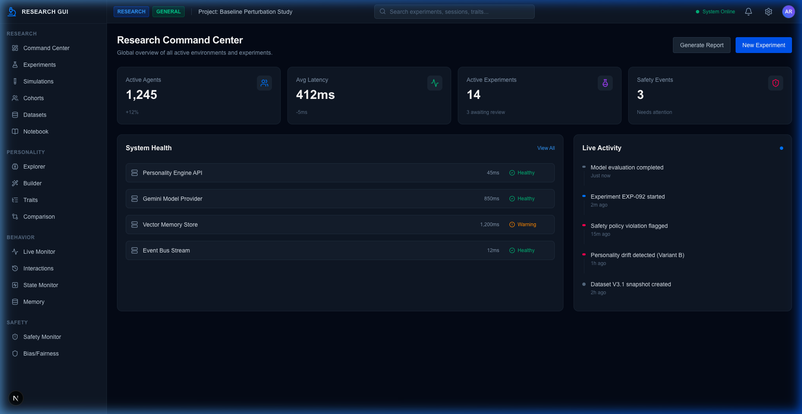

# Universal Research GUI

> A research-grade observability, experimentation, analysis, monitoring, evaluation, reproducibility, and governance interface for the Modular Personality AI Platform.



---

## Table of Contents

* [1. Overview](#1-overview)
* [2. Purpose](#2-purpose)
* [3. Scope](#3-scope)
* [4. Core Design Principles](#4-core-design-principles)
* [5. Relationship to the Modular Personality AI Platform](#5-relationship-to-the-modular-personality-ai-platform)
* [6. Supported Platform Variants](#6-supported-platform-variants)
* [7. Research Philosophy](#7-research-philosophy)
* [8. System Architecture](#8-system-architecture)
* [9. Application Architecture](#9-application-architecture)
* [10. User Roles](#10-user-roles)
* [11. Navigation](#11-navigation)
* [12. Research Command Center](#12-research-command-center)
* [13. Live System Monitor](#13-live-system-monitor)
* [14. Personality Explorer](#14-personality-explorer)
* [15. Personality Builder](#15-personality-builder)
* [16. Personality Template and Generation System](#16-personality-template-and-generation-system)
* [17. Trait Explorer](#17-trait-explorer)
* [18. Personality Comparison Lab](#18-personality-comparison-lab)
* [19. Personality Versioning](#19-personality-versioning)
* [20. Dynamic State Monitor](#20-dynamic-state-monitor)
* [21. Memory Explorer](#21-memory-explorer)
* [22. Interaction Explorer](#22-interaction-explorer)
* [23. Multimodal Monitoring](#23-multimodal-monitoring)
* [24. Model Observatory](#24-model-observatory)
* [25. Experiment Builder](#25-experiment-builder)
* [26. Experiment Runner](#26-experiment-runner)
* [27. Simulation Lab](#27-simulation-lab)
* [28. Counterfactual Experimentation](#28-counterfactual-experimentation)
* [29. Parameter Sweep Engine](#29-parameter-sweep-engine)
* [30. Behavioral Analysis](#30-behavioral-analysis)
* [31. Longitudinal Analysis](#31-longitudinal-analysis)
* [32. Psychometric Research](#32-psychometric-research)
* [33. Statistical Analysis](#33-statistical-analysis)
* [34. Evaluation Lab](#34-evaluation-lab)
* [35. Dataset Explorer](#35-dataset-explorer)
* [36. Cohort Explorer](#36-cohort-explorer)
* [37. Annotation Studio](#37-annotation-studio)
* [38. Research Notebook](#38-research-notebook)
* [39. Trace Explorer](#39-trace-explorer)
* [40. Event Explorer](#40-event-explorer)
* [41. Replay Mode](#41-replay-mode)
* [42. Safety Monitoring](#42-safety-monitoring)
* [43. Bias and Fairness](#43-bias-and-fairness)
* [44. Governance and Audit](#44-governance-and-audit)
* [45. Data Lineage](#45-data-lineage)
* [46. Reproducibility Center](#46-reproducibility-center)
* [47. Dashboard Builder](#47-dashboard-builder)
* [48. Global Search](#48-global-search)
* [49. Alerts and Notifications](#49-alerts-and-notifications)
* [50. Real-Time Architecture](#50-real-time-architecture)
* [51. API Architecture](#51-api-architecture)
* [52. Data Architecture](#52-data-architecture)
* [53. Event and Telemetry Architecture](#53-event-and-telemetry-architecture)
* [54. Plugin Architecture](#54-plugin-architecture)
* [55. Visualization Standards](#55-visualization-standards)
* [56. Accessibility](#56-accessibility)
* [57. Security](#57-security)
* [58. Privacy and Data Protection](#58-privacy-and-data-protection)
* [59. Clinical Research Safeguards](#59-clinical-research-safeguards)
* [60. Research Integrity](#60-research-integrity)
* [61. Technology Architecture](#61-technology-architecture)
* [62. Development](#62-development)
* [63. Testing](#63-testing)
* [64. Synthetic Data and Demo Mode](#64-synthetic-data-and-demo-mode)
* [65. Deployment](#65-deployment)
* [66. Configuration](#66-configuration)
* [67. Project Structure](#67-project-structure)
* [68. Development Standards](#68-development-standards)
* [69. Operational Standards](#69-operational-standards)
* [70. Example Research Workflow](#70-example-research-workflow)
* [71. Roadmap](#71-roadmap)
* [72. Long-Term Vision](#72-long-term-vision)
* [73. License](#73-license)

---

# 1. Overview

The **Universal Research GUI** is the research, observability, experimentation, analysis, monitoring, evaluation, and governance environment for the Modular Personality AI ecosystem.

It is designed to provide researchers, engineers, evaluators, and appropriately authorized clinical or enterprise users with a unified interface for understanding complex personality-driven AI systems.

The GUI is intentionally more than a dashboard.

It is designed as a **research laboratory for artificial personality systems**.

The system should allow users to move from:

```text
OBSERVATION
    ↓
INVESTIGATION
    ↓
EXPERIMENTATION
    ↓
MEASUREMENT
    ↓
ANALYSIS
    ↓
INTERPRETATION
    ↓
DOCUMENTATION
    ↓
REPRODUCTION
```

The GUI exists to make the underlying AI system observable at multiple levels.

These levels include:

* personality
* traits
* facets
* motivations
* values
* goals
* dynamic state
* memory
* context
* model selection
* model output
* tool usage
* multimodal perception
* behavioral responses
* experimental conditions
* system events
* safety events
* analytical outcomes

---

# 2. Purpose

The primary purpose of the Universal Research GUI is to provide a controlled environment in which complex AI personality systems can be observed, manipulated, compared, evaluated, and studied.

The GUI should enable researchers to answer questions such as:

* What personality configuration was active?
* What traits and facets were active?
* What personality version was used?
* What dynamic state was active?
* What contextual information was available?
* Which memories were retrieved?
* Which model generated the response?
* What system instructions were active?
* Which tools were called?
* What multimodal information was available?
* What behavior emerged?
* How stable was that behavior?
* How did the behavior change when one variable was modified?
* How did two personalities behave differently under identical conditions?
* How did two models behave differently with the same personality?
* How did behavior change over time?
* Which variables correlate with observed behavior?
* Can an experiment be reproduced?
* Where did a result originate?
* What uncertainty surrounds the result?

The GUI should transform these questions into structured research workflows.

---

# 3. Scope

The Universal Research GUI covers the entire research lifecycle of modular personality AI.

## 3.1 Personality Research

The GUI supports investigation of:

* personality structures
* trait systems
* facet systems
* values
* motivations
* preferences
* goals
* behavioral tendencies
* communication patterns
* decision tendencies
* contextual modifiers
* personality stability
* personality adaptation

## 3.2 Behavioral Research

The GUI supports:

* behavioral observation
* behavioral measurement
* behavioral comparison
* interaction analysis
* longitudinal analysis
* behavioral consistency analysis
* behavioral anomaly detection

## 3.3 AI Research

The GUI supports:

* model comparisons
* prompt/configuration comparisons
* model evaluation
* agent evaluation
* model/personality interactions
* model robustness
* model consistency

## 3.4 Multimodal Research

The GUI supports:

* text
* speech
* audio
* video
* computer vision
* facial movement signals
* gesture
* posture
* gaze
* multimodal event synchronization

## 3.5 Experimental Research

The GUI supports:

* controlled experiments
* A/B experiments
* parameter sweeps
* counterfactual experiments
* simulations
* longitudinal studies
* repeated trials
* controlled personality perturbation

## 3.6 Research Infrastructure

The GUI supports:

* datasets
* cohorts
* annotations
* notebooks
* statistical analysis
* psychometrics
* experiment provenance
* reproducibility
* data lineage
* auditability

---

# 4. Core Design Principles

## 4.1 Observe Before Interpreting

The system must distinguish between what was directly observed and what was inferred.

For example:

```text
Observed:
Facial movement detected.

Measured:
Movement intensity = 0.63.

Inferred:
Possible positive affect.

Human interpretation:
Researcher believes the behavior may correspond to positive engagement.
```

These four statements represent different levels of evidence.

The GUI must not collapse them into a single "emotion" field.

---

## 4.2 Measurement Is Not Diagnosis

A calculated score does not automatically constitute a psychological diagnosis.

This is particularly important for the Clinical variant.

The GUI should explicitly distinguish:

```text
Observation
    ↓
Measurement
    ↓
Model Inference
    ↓
Human Interpretation
    ↓
Clinical Decision
```

The AI should not be represented as autonomously making clinical determinations.

---

## 4.3 Personality Is Multidimensional

A personality should never be represented solely by a single label.

The architecture should support hierarchical personality representations:

```text
Personality
├── Domain
│   ├── Trait
│   │   ├── Facet
│   │   │   └── Subfacet
│   │   └── Behavioral Indicators
│   └── Trait
├── Values
├── Motivations
├── Goals
├── Preferences
└── Communication Characteristics
```

The GUI must make individual components inspectable.

---

## 4.4 Personality Is Not State

Personality represents relatively persistent configuration.

State represents dynamic computational conditions.

For example:

```text
PERSONALITY
├── Trait configuration
├── Values
├── Preferences
├── Motivations
└── Behavioral tendencies

STATE
├── Current uncertainty
├── Current task pressure
├── Current engagement
├── Current computational load
└── Current modeled affective variables
```

The GUI must preserve this distinction.

---

## 4.5 Behavior Is Contextual

The GUI must avoid simplistic claims such as:

> Trait X causes behavior Y.

Instead, behavior should be represented as emerging from interacting variables.

```text
Personality
      +
State
      +
Context
      +
Memory
      +
Goals
      +
Task
      +
Perception
      +
Model
      +
Environment
      ↓
Behavior
```

The GUI should make those variables available for controlled investigation.

---

## 4.6 Preserve Uncertainty

Where an inference is uncertain, the uncertainty should be visible.

The GUI should support:

* confidence intervals
* probability distributions
* confidence values
* measurement error
* missingness
* model uncertainty
* annotation disagreement
* uncertainty metadata

The interface should not visually imply precision that the underlying data does not support.

---

## 4.7 Preserve Provenance

Every important result should be traceable to its source.

A result should ideally allow the researcher to determine:

```text
Result
  ↓
Analysis
  ↓
Experiment
  ↓
Interaction
  ↓
Model
  ↓
Personality
  ↓
Dataset
  ↓
Configuration
```

---

## 4.8 Reproducibility Is a First-Class Feature

Experiments should not merely be saved as a name and timestamp.

The system should preserve sufficient metadata to reproduce them.

This may include:

* software version
* model version
* personality version
* dataset version
* experiment parameters
* random seed
* environment
* dependencies
* configuration
* analysis version

---

## 4.9 Variant Isolation

General, Enterprise, Clinical, and Research environments must remain logically isolated.

The interface must always communicate:

```text
VARIANT
ENVIRONMENT
DATA CLASSIFICATION
USER ROLE
```

---

# 5. Relationship to the Modular Personality AI Platform

The Universal Research GUI is not the personality engine.

It is an external research and observability layer.

Conceptually:

```text
                 UNIVERSAL RESEARCH GUI
                           |
          +----------------+----------------+
          |                |                |
          ↓                ↓                ↓
      Research         Monitoring       Governance
      Services          Services          Services
          |                |                |
          +----------------+----------------+
                           |
                      Platform APIs
                           |
              +------------+------------+
              |            |            |
         Personality     Model       Multimodal
           Engine       Engine         Engine
              |            |            |
              +------------+------------+
                           |
                      Memory / State
```

The GUI should communicate with platform services through documented APIs and event streams.

It should not rely on undocumented internal implementation details.

---

# 6. Supported Platform Variants

The GUI supports four primary variants.

## 6.1 General

Designed for:

* conversational AI
* character AI
* social AI
* interactive assistants
* simulations
* creative applications

Primary emphasis:

* personality
* behavior
* interaction
* memory
* state
* multimodal interaction

---

## 6.2 Enterprise

Designed for:

* organizational agents
* business assistants
* workflow agents
* customer-facing AI
* internal AI systems

Primary emphasis:

* reliability
* permissions
* governance
* workflows
* security
* auditability
* operational performance

---

## 6.3 Clinical

Designed for authorized research environments.

Potential uses include:

* clinical research
* psychometric research
* behavioral research
* longitudinal research
* clinician-supported investigation

Primary emphasis:

* evidence
* measurements
* uncertainty
* longitudinal analysis
* research governance
* human oversight

The Clinical variant must not represent AI-generated personality or behavioral inference as a diagnosis without appropriate validation and qualified human interpretation.

---

## 6.4 Research

The Research variant exposes the broadest experimental functionality.

It supports:

* simulations
* controlled experiments
* personality perturbation
* model comparisons
* parameter sweeps
* statistical analysis
* psychometric research
* longitudinal analysis
* behavioral analysis
* multimodal research
* reproducibility

---

# 7. Research Philosophy

The GUI should function according to a scientific workflow.

```text
Research Question
       ↓
Hypothesis
       ↓
Operationalization
       ↓
Experiment Design
       ↓
Variables
       ↓
Controls
       ↓
Execution
       ↓
Measurement
       ↓
Analysis
       ↓
Interpretation
       ↓
Limitations
       ↓
Reproduction
```

The GUI should encourage researchers to explicitly define:

* what they are testing
* what they are changing
* what they are measuring
* what they are controlling
* what assumptions they are making
* what limitations exist

---

# 8. System Architecture

The reference architecture is:

```text
+----------------------------------------------------+
|                     UI Layer                       |
| React / Next.js / TypeScript / Visualization      |
+----------------------------------------------------+
|                Application Layer                  |
| State / Routing / Permissions / Workflows         |
+----------------------------------------------------+
|                  Research Layer                   |
| Experiments / Analysis / Simulation / Evaluation  |
+----------------------------------------------------+
|                Observability Layer                |
| Events / Traces / Metrics / Logs / Streaming      |
+----------------------------------------------------+
|                     API Layer                     |
| REST / GraphQL / WebSocket / SSE                 |
+----------------------------------------------------+
|                  Platform Layer                   |
| Personality / Models / Memory / State / Vision    |
+----------------------------------------------------+
```

The system should remain modular.

Each major service should be replaceable without requiring a complete rewrite of the GUI.

---

# 9. Application Architecture

Recommended logical architecture:

```text
Application
│
├── Research
│   ├── Command Center
│   ├── Experiments
│   ├── Simulations
│   ├── Cohorts
│   ├── Datasets
│   └── Notebook
│
├── Personality
│   ├── Explorer
│   ├── Builder
│   ├── Generator
│   ├── Traits
│   ├── Comparison
│   └── Templates
│
├── Behavior
│   ├── Live Monitor
│   ├── Interactions
│   ├── State
│   ├── Memory
│   └── Analysis
│
├── Multimodal
│   ├── Vision
│   ├── Audio
│   ├── Speech
│   ├── Video
│   └── Fusion
│
├── Models
│   ├── Observatory
│   ├── Registry
│   ├── Comparison
│   └── Evaluation
│
├── Analysis
│   ├── Statistics
│   ├── Psychometrics
│   ├── Longitudinal
│   └── Correlations
│
├── Safety
│   ├── Events
│   ├── Anomalies
│   └── Bias/Fairness
│
└── Governance
    ├── Audit
    ├── Lineage
    ├── Access
    └── Configuration
```

---

# 10. User Roles

The GUI should support role-based functionality.

Potential roles include:

## Viewer

Can:

* inspect dashboards
* view permitted experiments
* view approved analyses

Cannot:

* modify configurations
* execute experiments
* access restricted data

## Researcher

Can:

* create experiments
* create personalities
* run analyses
* annotate data
* use research datasets

## Senior Researcher

Can additionally:

* approve experiments
* manage research projects
* manage cohorts
* publish results

## Engineer

Can:

* inspect system telemetry
* inspect models
* diagnose errors
* manage integrations

## Administrator

Can:

* manage users
* manage permissions
* configure environments
* review audit logs

## Clinical Researcher

Can access Clinical functionality subject to authorization and applicable governance.

## Enterprise Operator

Can access enterprise systems according to organizational permissions.

Roles should be configurable.

---

# 11. Navigation

Primary navigation:

```text
Research
├── Command Center
├── Experiments
├── Simulations
├── Cohorts
├── Datasets
└── Research Notebook

Personality
├── Explorer
├── Builder
├── Generator
├── Traits
├── Comparison
└── Templates

Behavior
├── Live Monitor
├── Interactions
├── State
├── Memory
└── Analysis

Multimodal
├── Vision
├── Audio
├── Speech
├── Video
└── Fusion

Models
├── Observatory
├── Registry
├── Comparison
└── Evaluation

Analysis
├── Statistics
├── Psychometrics
├── Longitudinal
└── Correlations

Safety
├── Events
├── Anomalies
└── Bias/Fairness

Governance
├── Audit
├── Lineage
├── Access
└── Configuration
```

---

# 12. Research Command Center

The Research Command Center is the main research overview.

It should provide:

## System Health

* active systems
* active sessions
* model availability
* API availability
* latency
* throughput
* errors
* resource utilization

## Research Activity

* running experiments
* queued experiments
* completed experiments
* failed experiments
* recent analyses
* recent datasets
* recent annotations

## Personality Activity

* active personalities
* personality versions
* personality distribution
* trait changes
* behavioral consistency

## Safety

* active alerts
* anomalous behavior
* safety events
* system warnings

All metrics should support drill-down.

---

# 13. Live System Monitor

The Live System Monitor provides near-real-time observation.

It should expose:

* active sessions
* agents
* model
* personality
* state
* memory
* perception
* tools
* response generation
* latency
* errors
* event streams

The UI should support:

* live filtering
* pause
* resume
* event inspection
* trace selection
* session pinning
* historical comparison

---

# 14. Personality Explorer

The Personality Explorer provides a multidimensional view of a personality.

Supported visualizations:

* hierarchical trees
* radar charts
* trait matrices
* distributions
* parallel coordinates
* timelines
* trait networks

Example:

```text
Personality
│
├── Domain
│   ├── Trait
│   │   ├── Facet
│   │   └── Facet
│   └── Trait
│
├── Values
├── Motivations
├── Goals
└── Preferences
```

Every displayed value should be traceable to:

* configuration
* version
* source
* timestamp
* author
* experiment

---

# 15. Personality Builder

The Personality Builder allows researchers to construct personalities.

Supported properties include:

* traits
* facets
* subfacets
* values
* motivations
* preferences
* goals
* communication style
* behavioral tendencies
* decision tendencies
* contextual modifiers

The builder should provide:

* sliders
* numerical values
* distributions
* categorical values
* free-form descriptions
* constraints
* dependencies
* templates
* cloning
* versioning
* validation

A personality should be represented structurally.

The GUI should not depend on one enormous natural-language prompt to represent personality.

---

# 16. Personality Template and Generation System

The GUI should include a personality creation system capable of generating new personality configurations from:

* trait combinations
* personality frameworks
* user-defined trait sets
* predefined archetypes
* structured descriptions
* imported configurations
* random generation
* controlled distributions

Example:

```text
Generation Mode:
Trait-Based

Traits:
- Openness
- Conscientiousness
- Extraversion
- Agreeableness
- Emotional Stability

Constraints:
- High Openness
- Moderate Conscientiousness
- Low Extraversion

Output:
Personality Configuration
```

Generated personalities must receive unique identifiers and versions.

The GUI should clearly label generated personalities as generated configurations.

---

# 17. Trait Explorer

The Trait Explorer provides detailed information about a trait.

A trait page should contain:

* name
* definition
* framework
* score
* facets
* subfacets
* history
* behavioral associations
* experimental history
* correlations
* provenance

Researchers should be able to perform controlled trait perturbations.

Example:

```text
Baseline:
Trait = 0.40

Condition A:
Trait = 0.60

Condition B:
Trait = 0.80
```

The experiment system should record exactly which variables changed.

---

# 18. Personality Comparison Lab

The comparison environment supports:

* personality vs personality
* personality version vs version
* personality vs baseline
* personality vs generated variant

Comparison views should include:

* trait differences
* facet differences
* state differences
* behavior differences
* response differences
* consistency
* performance

Researchers should be able to select the same task and context and run multiple personalities against it.

---

# 19. Personality Versioning

Every personality modification should create a version.

Example:

```text
Personality: P-001

Version 1.0
    Initial configuration

Version 1.1
    Modified openness

Version 1.2
    Modified motivation model

Version 2.0
    Structural redesign
```

The system should support:

* diff
* rollback
* cloning
* branching
* tagging
* comparison
* experiment association

---

# 20. Dynamic State Monitor

The Dynamic State Monitor tracks computational state.

Potential dimensions:

* arousal
* uncertainty
* engagement
* confidence
* frustration
* task pressure
* computational load
* motivation
* modeled affective variables

The UI should show state trajectories over time.

Example:

```text
Time
│
├── State A
├── State B
├── State C
└── State D
```

State variables should not be represented as equivalent to validated human psychological states unless independently validated.

---

# 21. Memory Explorer

The Memory Explorer provides visibility into memory.

Memory categories may include:

* working context
* episodic memory
* semantic memory
* social memory
* task memory
* long-term memory

Researchers should be able to inspect:

* creation
* retrieval
* relevance
* source
* timestamp
* confidence
* decay
* consolidation
* modification
* deletion

A key research question should always be answerable:

> What information was available to the system at the time of this response?

---

# 22. Interaction Explorer

Interactions should be displayed as complete timelines.

```text
Input
  ↓
Perception
  ↓
Context Assembly
  ↓
Memory Retrieval
  ↓
Personality Resolution
  ↓
State Resolution
  ↓
Model Invocation
  ↓
Tool Calls
  ↓
Response
  ↓
State Update
  ↓
Memory Update
```

Researchers should be able to expand each stage.

---

# 23. Multimodal Monitoring

The Multimodal Monitor should synchronize:

* text
* audio
* speech
* video
* facial movement
* gesture
* gaze
* posture
* timestamps
* system events

The system must distinguish:

```text
Raw Signal
    ↓
Processed Signal
    ↓
Measurement
    ↓
Model Inference
    ↓
Human Interpretation
```

For example:

```text
Facial movement detected
```

must not automatically become:

```text
User is happy
```

without preserving the inference boundary.

---

# 24. Model Observatory

The Model Observatory provides visibility into every integrated model.

For each model:

* provider
* identifier
* version
* capabilities
* limits
* latency
* throughput
* failure rate
* evaluation results
* configuration
* deployment state
* known limitations

The system should support:

* model comparison
* historical performance
* deployment comparison
* evaluation comparison

---

# 25. Experiment Builder

The Experiment Builder is a core component.

Each experiment should support:

```text
Experiment
├── Research Question
├── Hypothesis
├── Independent Variables
├── Dependent Variables
├── Controls
├── Personality
├── Model
├── Context
├── Dataset
├── Sample
├── Repetitions
├── Randomization
├── Evaluation
└── Analysis Plan
```

The visual workflow should be:

```text
INPUT
  ↓
CONDITION
  ↓
PERSONALITY
  ↓
STATE
  ↓
CONTEXT
  ↓
MODEL
  ↓
INTERACTION
  ↓
MEASUREMENT
  ↓
ANALYSIS
```

---

# 26. Experiment Runner

Experiments should support:

* interactive execution
* batch execution
* parallel execution
* scheduled execution
* repeated trials
* distributed execution

The interface should show:

* progress
* throughput
* failures
* partial results
* logs
* resource consumption
* completion status

Experiments should support pause and resume when technically possible.

---

# 27. Simulation Lab

The Simulation Lab provides controlled environments.

Researchers should be able to define:

* synthetic users
* synthetic personalities
* environments
* tasks
* social conditions
* context
* memory conditions
* model configurations

Example:

```text
Personality:
High conscientiousness

Environment:
High time pressure

Task:
Decision making

Runs:
1,000

Condition:
Baseline
```

Results should be presented as distributions.

---

# 28. Counterfactual Experimentation

Researchers should be able to change one or more variables while holding other variables constant.

Example:

```text
Baseline:
Trait = 0.40

Counterfactual:
Trait = 0.80
```

Or:

```text
Model:
A → B
```

Or:

```text
Memory:
Enabled → Disabled
```

The system should explicitly record:

* changed variables
* unchanged variables
* baseline
* counterfactual
* resulting behavior

---

# 29. Parameter Sweep Engine

The GUI should support systematic variation of parameters.

Example:

```text
Trait:
0.0
0.1
0.2
0.3
...
1.0
```

For every configuration the system should record:

* parameter values
* run ID
* model
* personality version
* seed
* context
* output
* measurements

Results should support:

* heatmaps
* response curves
* distributions
* threshold detection
* clustering

---

# 30. Behavioral Analysis

Behavioral metrics may include:

* response length
* response timing
* initiative
* turn-taking
* interruption
* agreement
* disagreement
* persistence
* refusal
* topic switching
* conversational engagement
* conflict
* social responsiveness

Metrics should have formal definitions.

For example:

```text
Metric:
Response Latency

Definition:
Elapsed time between completion of user input and
generation of the system's first response token.
```

---

# 31. Longitudinal Analysis

Longitudinal analysis allows researchers to investigate changes over time.

Tracked dimensions may include:

* personality
* state
* behavior
* memory
* performance
* interaction patterns

Visualizations may include:

* trajectories
* rolling averages
* event overlays
* state transitions
* change points
* distributions

The GUI should support comparing multiple longitudinal traces.

---

# 32. Psychometric Research

The psychometric workspace supports authorized research involving structured measurements.

Potential functionality includes:

* reliability analysis
* internal consistency
* test-retest analysis
* item analysis
* scale analysis
* factor analysis integration
* correlations
* score trajectories
* measurement comparison

The GUI must preserve the distinction between:

```text
Instrument
    ↓
Measurement
    ↓
Score
    ↓
Inference
```

No measurement should automatically be interpreted as a clinical diagnosis.

---

# 33. Statistical Analysis

The Statistics workspace should support:

* descriptive statistics
* distributions
* correlations
* regression
* group comparison
* effect sizes
* confidence intervals
* clustering
* dimensionality reduction
* time-series analysis

Each result should expose:

* methodology
* sample size
* variables
* missing data
* assumptions
* uncertainty
* analysis version

---

# 34. Evaluation Lab

Evaluation should operate at several levels.

## Personality Evaluation

* consistency
* trait adherence
* coherence
* stability
* contextual adaptability

## Model Evaluation

* quality
* robustness
* calibration
* latency
* failure rate
* consistency

## Multimodal Evaluation

* signal quality
* synchronization
* missing data
* modality agreement

## System Evaluation

* reliability
* safety
* performance
* resource utilization

---

# 35. Dataset Explorer

The Dataset Explorer should provide:

* schema
* size
* version
* provenance
* classification
* permissions
* creation date
* modification history
* lineage

Researchers should be able to:

* filter
* sample
* inspect
* compare versions
* visualize distributions

---

# 36. Cohort Explorer

The Cohort Explorer allows authorized researchers to construct research groups.

Capabilities include:

* filtering
* grouping
* matching
* sampling
* descriptive analysis
* missingness analysis
* cohort comparison

Sensitive data should be minimized and access-controlled.

---

# 37. Annotation Studio

Researchers should be able to annotate:

* interactions
* responses
* behaviors
* multimodal events
* safety events
* experimental outcomes

The system should support:

* multiple annotators
* blinded annotation
* annotation versioning
* inter-rater agreement
* disagreement analysis
* adjudication

Annotation provenance must be retained.

---

# 38. Research Notebook

The Research Notebook provides persistent research documentation.

Researchers can record:

* hypotheses
* observations
* methodological decisions
* experiment notes
* analyses
* conclusions
* limitations
* future work

Notebook entries should support references to:

* experiments
* personalities
* models
* datasets
* interactions
* analyses
* annotations

---

# 39. Trace Explorer

The Trace Explorer provides end-to-end execution traces.

Example:

```text
Session
  ↓
Interaction
  ↓
Context
  ↓
Memory
  ↓
Personality
  ↓
State
  ↓
Model
  ↓
Tool
  ↓
Response
```

Researchers should be able to inspect the entire causal execution chain as recorded by the system.

The interface must label recorded execution relationships as execution relationships rather than automatically treating them as proof of psychological causality.

---

# 40. Event Explorer

Every major system action should produce a structured event.

Examples:

```text
PERSONALITY_LOADED
PERSONALITY_UPDATED
PERSONALITY_VERSION_CREATED
STATE_CHANGED
MEMORY_CREATED
MEMORY_RETRIEVED
MEMORY_UPDATED
MODEL_CALLED
MODEL_RESPONSE_RECEIVED
TOOL_CALLED
VISION_EVENT
AUDIO_EVENT
SPEECH_EVENT
RESPONSE_GENERATED
EXPERIMENT_STARTED
EXPERIMENT_COMPLETED
EXPERIMENT_FAILED
SAFETY_EVENT
CONFIGURATION_CHANGED
PERMISSION_CHANGED
```

Events should support:

* filtering
* searching
* correlation
* timeline views
* trace association
* export where authorized

---

# 41. Replay Mode

Replay Mode allows researchers to reconstruct historical interactions.

The system should distinguish:

## Original

The actual recorded execution.

## Replay

A new execution attempting to reproduce the original configuration.

## Counterfactual

A new execution in which one or more variables are intentionally changed.

Example:

```text
ORIGINAL

Model A
Personality A
Context A
Memory A


REPLAY

Model A
Personality A
Context A
Memory A


COUNTERFACTUAL

Model A
Personality B
Context A
Memory A
```

---

# 42. Safety Monitoring

The Safety Monitor should identify:

* anomalies
* unexpected behavior
* unsafe outputs
* system errors
* policy violations
* personality drift
* privacy incidents
* configuration errors

Each event should include:

```text
Event ID
Timestamp
Severity
System
Variant
Evidence
Status
Resolution
Actor
Provenance
```

---

# 43. Bias and Fairness

The Bias and Fairness workspace should allow authorized researchers to investigate systematic differences.

Potential measures include:

* error rates
* calibration
* response characteristics
* behavioral differences
* model performance
* annotation disagreement

The system should warn when observed differences may be affected by:

* sample size
* missing data
* measurement differences
* dataset imbalance
* contextual differences
* annotation bias

The system should not infer sensitive attributes unnecessarily.

---

# 44. Governance and Audit

The Governance system provides:

* audit logs
* configuration history
* model registry
* experiment provenance
* access logs
* deployment history
* permission changes

Every sensitive action should be attributable to an authenticated actor.

---

# 45. Data Lineage

Data Lineage provides a graph of how information moved through the system.

Example:

```text
DATASET
   ↓
SAMPLE
   ↓
EXPERIMENT
   ↓
PERSONALITY
   ↓
MODEL
   ↓
INTERACTION
   ↓
MEASUREMENT
   ↓
ANALYSIS
   ↓
RESULT
```

The researcher should be able to ask:

> Where did this result come from?

and:

> What data and configuration contributed to it?

---

# 46. Reproducibility Center

Every experiment should generate a reproducibility record.

The record should include, where applicable:

* experiment ID
* experiment version
* configuration
* personality version
* model version
* dataset version
* software version
* dependency versions
* random seed
* environment
* timestamps
* analysis configuration

The GUI should provide a:

**Reproduce Experiment**

workflow.

---

# 47. Dashboard Builder

Researchers should be able to build custom dashboards.

Widgets may include:

* metrics
* charts
* tables
* timelines
* traces
* personality visualizations
* experiment status
* model status
* statistical outputs
* alerts

Dashboards should support:

* saving
* cloning
* versioning
* sharing
* exporting

---

# 48. Global Search

Global search should support all authorized resources.

Searchable objects include:

* personalities
* personality versions
* traits
* experiments
* simulations
* models
* sessions
* datasets
* cohorts
* events
* traces
* notebooks
* annotations
* analyses

Filters should include:

```text
Variant
Environment
Date
Model
Personality
Experiment
Status
Severity
Research Project
Data Classification
```

---

# 49. Alerts and Notifications

Alerts should be configurable for:

* latency spikes
* error spikes
* experiment failures
* safety events
* anomalous behavior
* personality drift
* unexpected configuration changes
* data changes
* deployment changes

Alerts should support:

* severity
* thresholds
* cooldown periods
* acknowledgment
* escalation
* audit history

---

# 50. Real-Time Architecture

The real-time system should support:

* WebSockets
* Server-Sent Events
* event streams
* batching
* incremental rendering
* backpressure
* server-side aggregation
* caching
* virtualized lists

Conceptually:

```text
Event Source
    ↓
Event Bus
    ├── Live Monitor
    ├── Trace Storage
    ├── Analytics
    ├── Alert Engine
    └── Audit System
```

The frontend must remain responsive under high event volumes.

---

# 51. API Architecture

The GUI should communicate with backend services through versioned APIs.

## REST

Use for:

* CRUD
* configuration
* metadata
* experiments
* personalities
* models
* datasets

## GraphQL

May be used where complex research queries benefit from flexible selection.

## WebSocket / SSE

Use for:

* live telemetry
* experiment progress
* streaming events
* alerts
* live sessions

All APIs should be strongly typed.

---

# 52. Data Architecture

The system should maintain explicit distinctions between:

```text
Identity
Personality
Trait
State
Context
Memory
Observation
Measurement
Inference
Annotation
Outcome
Experiment
Analysis
```

Example:

```text
Observation
├── Source
├── Timestamp
├── Raw Data
├── Processing
└── Provenance

Measurement
├── Value
├── Unit
├── Method
├── Instrument
├── Timestamp
└── Uncertainty

Inference
├── Model
├── Input
├── Output
├── Confidence
└── Version
```

This prevents different types of evidence from being accidentally treated as equivalent.

---

# 53. Event and Telemetry Architecture

The platform should produce structured telemetry.

Events should be:

* timestamped
* typed
* versioned
* attributable
* traceable
* serializable
* queryable

A common event envelope should contain:

```text
event_id
event_type
timestamp
source
variant
environment
session_id
trace_id
actor_id
payload
schema_version
```

Sensitive information should not be included in telemetry unless explicitly required.

---

# 54. Plugin Architecture

The GUI should support plugins for:

* personality frameworks
* trait frameworks
* visualizations
* metrics
* model providers
* datasets
* statistical methods
* experiment types
* evaluation methods
* external integrations

Plugins should declare:

```text
name
version
capabilities
permissions
compatibility
data_requirements
```

Plugins must operate under permission boundaries.

---

# 55. Visualization Standards

Visualization must prioritize scientific clarity.

Supported visualizations include:

* line charts
* scatter plots
* histograms
* box plots
* violin plots
* distributions
* heatmaps
* correlation matrices
* parallel coordinates
* timelines
* networks
* state transition diagrams

Every analytical visualization should expose:

* units
* sample size
* time range
* aggregation
* uncertainty
* provenance

Color must not be the only way to communicate information.

---

# 56. Accessibility

The application should support:

* keyboard navigation
* screen readers
* semantic HTML
* accessible tables
* accessible dialogs
* high contrast
* scalable text
* focus management
* reduced motion

Interactive research visualizations should provide accessible alternatives where feasible.

---

# 57. Security

Security requirements include:

* authentication
* authorization
* role-based access control
* server-side permission enforcement
* secure sessions
* encrypted communication
* encrypted storage where appropriate
* audit logging
* tenant isolation
* input validation
* rate limiting
* session expiration
* secure secret management

The frontend must never be treated as a security boundary.

All authorization must be enforced server-side.

---

# 58. Privacy and Data Protection

The system should follow data minimization principles.

Sensitive information should be:

* collected only when necessary
* access-controlled
* encrypted
* auditable
* retained according to policy
* redacted during export where appropriate
* excluded from logs unless explicitly required

Special care should be given to:

* clinical data
* biometric data
* facial data
* voice data
* personally identifiable information
* sensitive research data

---

# 59. Clinical Research Safeguards

The Clinical environment requires additional controls.

The system should distinguish:

```text
Observation
    ↓
Measurement
    ↓
Algorithmic Inference
    ↓
Human Interpretation
    ↓
Clinical Decision
```

The GUI must not represent an AI-generated inference as a diagnosis.

Clinical functionality should be governed by:

* appropriate validation
* human oversight
* privacy controls
* access controls
* documented limitations
* research governance
* applicable regulatory requirements

The system should clearly communicate when an output is:

* experimental
* unvalidated
* model-generated
* research-only

---

# 60. Research Integrity

The GUI is intended to support rigorous research.

## Correlation Is Not Causation

A relationship between two variables does not automatically establish causality.

## Model Output Is Not Automatically Evidence

An AI-generated interpretation is not automatically a measurement.

## Measurement Is Not Automatically Diagnosis

Especially in clinical environments, measurement requires appropriate interpretation and validation.

## Preserve Alternative Explanations

Researchers should be able to document competing hypotheses.

## Preserve Limitations

Every experiment should have a place to document:

* limitations
* assumptions
* missing data
* confounders
* uncertainty

## Preserve Provenance

Research results should be traceable.

---

# 61. Technology Architecture

A recommended reference stack is:

## Frontend

* TypeScript
* React
* Next.js
* TanStack Query
* accessible component library
* scientific visualization libraries

## Backend

The backend may use services for:

* experiment orchestration
* analytics
* observability
* event processing
* statistical processing
* trace querying
* streaming
* model metadata
* personality management

## Storage

Use appropriate storage systems for:

* relational metadata
* analytical datasets
* event streams
* object storage
* vector data where appropriate

The frontend should never depend directly on database implementation details.

---

# 62. Development

Clone the repository:

```bash
git clone <repository>
cd universal-research-gui
```

Install dependencies:

```bash
npm install
```

Create local configuration:

```bash
cp .env.example .env.local
```

Start development:

```bash
npm run dev
```

The exact commands should be updated to match the final implementation.

---

# 63. Testing

Testing should occur at multiple levels.

## Unit Tests

Test:

* calculations
* validation
* state transformations
* permissions
* formatting
* domain logic

## Integration Tests

Test:

* APIs
* event streams
* storage
* experiments
* permissions
* data loading

## End-to-End Tests

Example workflow:

```text
Create Personality
       ↓
Create Experiment
       ↓
Run Experiment
       ↓
Inspect Results
       ↓
Perform Analysis
       ↓
Document Result
       ↓
Reproduce Experiment
```

## Security Testing

Test:

* authorization
* privilege escalation
* tenant isolation
* export restrictions
* session handling
* permission boundaries

## Accessibility Testing

Test:

* keyboard navigation
* screen readers
* focus
* contrast
* reduced motion

---

# 64. Synthetic Data and Demo Mode

The GUI should include a fully isolated Demo Mode.

Demo Mode should provide:

* synthetic personalities
* synthetic traits
* synthetic interactions
* synthetic experiments
* synthetic models
* synthetic multimodal events
* synthetic cohorts
* synthetic statistical results

Synthetic data must be clearly labeled.

Demo Mode must never accidentally connect to:

* production
* clinical environments
* enterprise environments
* restricted research datasets

---

# 65. Deployment

Deployment should support separate environments:

```text
Development
     ↓
Testing
     ↓
Staging
     ↓
Production
```

Each environment should have independent:

* credentials
* secrets
* databases
* event streams
* configuration
* access policies

The following environments should remain logically isolated:

```text
General
Enterprise
Clinical
Research
```

---

# 66. Configuration

Configuration should be environment-specific.

Configuration categories include:

```text
APPLICATION
API
AUTHENTICATION
DATABASE
STREAMING
STORAGE
ANALYTICS
MODEL SERVICES
FEATURE FLAGS
PLUGIN SYSTEM
SECURITY
AUDITING
VARIANT
ENVIRONMENT
```

Secrets must never be committed to source control.

---

# 67. Project Structure

Recommended structure:

```text
universal-research-gui/
│
├── app/
│   ├── command-center/
│   ├── experiments/
│   ├── simulations/
│   ├── personalities/
│   ├── interactions/
│   ├── multimodal/
│   ├── models/
│   ├── analysis/
│   ├── psychometrics/
│   ├── datasets/
│   ├── cohorts/
│   ├── annotations/
│   ├── notebook/
│   ├── safety/
│   ├── governance/
│   └── settings/
│
├── components/
│   ├── charts/
│   ├── tables/
│   ├── timelines/
│   ├── personality/
│   ├── experiments/
│   ├── traces/
│   ├── multimodal/
│   └── common/
│
├── lib/
│   ├── api/
│   ├── auth/
│   ├── permissions/
│   ├── analytics/
│   ├── streaming/
│   ├── validation/
│   └── configuration/
│
├── services/
│   ├── experiments/
│   ├── analytics/
│   ├── observability/
│   ├── datasets/
│   └── personality/
│
├── types/
│
├── tests/
│   ├── unit/
│   ├── integration/
│   ├── e2e/
│   ├── security/
│   └── accessibility/
│
├── docs/
│
├── public/
│
├── config/
│
├── scripts/
│
└── README.md
```

---

# 68. Development Standards

The project should follow professional engineering standards.

## Code Quality

Use:

* strict TypeScript
* linting
* formatting
* type checking
* documented interfaces
* modular architecture

## Version Control

Use:

* feature branches
* pull requests
* code review
* semantic commits where appropriate
* tagged releases

## API Stability

APIs should be:

* versioned
* documented
* backward-compatible where practical

## Documentation

Major modules should include:

* purpose
* architecture
* API
* configuration
* limitations
* testing strategy

---

# 69. Operational Standards

Production deployments should provide:

* health checks
* readiness checks
* metrics
* logs
* traces
* alerting
* audit logs
* backups
* disaster recovery procedures

Operational monitoring should distinguish between:

```text
Application Failure
Model Failure
Data Failure
Experiment Failure
Network Failure
Infrastructure Failure
```

---

# 70. Example Research Workflow

The following example demonstrates how the GUI should be used.

## Research Question

> How does changing a personality trait affect behavior under controlled conditions?

## Step 1 — Create Baseline Personality

```text
Personality:
P-001

Trait:
Conscientiousness = 0.40
```

## Step 2 — Create Experimental Conditions

```text
Condition A:
Conscientiousness = 0.60

Condition B:
Conscientiousness = 0.80

Condition C:
Conscientiousness = 1.00
```

## Step 3 — Define Controls

Keep constant:

```text
Model
Task
Context
Memory
System Configuration
Sampling Configuration
```

## Step 4 — Define Measurements

Potential measurements:

```text
Response latency
Response structure
Task completion
Error rate
Planning depth
Refusal rate
Consistency
```

## Step 5 — Run Experiment

Run multiple trials for each condition.

## Step 6 — Inspect Traces

Inspect:

```text
Input
↓
Personality
↓
State
↓
Memory
↓
Model
↓
Response
```

## Step 7 — Analyze

Compare distributions rather than relying on a single response.

## Step 8 — Document

Record:

* hypothesis
* methodology
* results
* uncertainty
* limitations

## Step 9 — Reproduce

Use the Reproducibility Center to rerun the experiment.

---

# 71. Roadmap

## Phase 1 — Foundation

* application shell
* design system
* authentication
* permissions
* environment management
* API layer
* event model
* basic monitoring

## Phase 2 — Personality

* Personality Explorer
* Personality Builder
* Personality Generator
* Trait Explorer
* Personality Comparison
* Versioning

## Phase 3 — Observability

* Live Monitor
* Interaction Explorer
* State Monitor
* Memory Explorer
* Trace Explorer
* Event Explorer

## Phase 4 — Experimentation

* Experiment Builder
* Experiment Runner
* Simulation Lab
* Counterfactuals
* Parameter Sweeps
* Repeated Trials

## Phase 5 — Analysis

* Behavioral Analysis
* Statistical Analysis
* Longitudinal Analysis
* Psychometrics
* Correlations

## Phase 6 — Multimodal

* Vision
* Audio
* Speech
* Video
* Multimodal synchronization
* Multimodal event analysis

## Phase 7 — Research Infrastructure

* datasets
* cohorts
* annotations
* notebooks
* lineage
* reproducibility

## Phase 8 — Governance

* audit
* safety
* fairness
* model governance
* advanced permissions
* data governance

## Phase 9 — Advanced Research

Potential capabilities include:

* large-scale personality simulations
* population simulations
* advanced causal experimentation
* adaptive experiment design
* automated hypothesis generation
* multimodal longitudinal modeling
* behavioral anomaly discovery
* model/personality interaction analysis
* automated experiment proposals
* large-scale parameter sweeps
* evolutionary personality experiments

---

# 72. Long-Term Vision

The Universal Research GUI is intended to become the central research interface for the Modular Personality AI ecosystem.

Its purpose is not simply to show what the AI said.

It should make it possible to investigate:

```text
WHAT happened
       ↓
WHEN it happened
       ↓
UNDER WHAT CONDITIONS
       ↓
WHICH PERSONALITY was active
       ↓
WHICH TRAITS were active
       ↓
WHICH STATE was active
       ↓
WHAT MEMORY was available
       ↓
WHICH MODEL was active
       ↓
WHAT PERCEPTION SIGNALS existed
       ↓
WHAT BEHAVIOR emerged
       ↓
HOW THE BEHAVIOR CHANGED
       ↓
WHETHER THE RESULT IS REPRODUCIBLE
```

The long-term system should allow researchers to move seamlessly between:

```text
OBSERVATION
     ↓
EXPERIMENTATION
     ↓
ANALYSIS
     ↓
INTERPRETATION
     ↓
DOCUMENTATION
     ↓
REPRODUCTION
```

The GUI should ultimately become the:

* research laboratory
* observability layer
* experimentation environment
* analysis environment
* evaluation environment
* reproducibility system
* governance interface
* scientific record

for the Modular Personality AI ecosystem.

---

# 73. License

The licensing model should be determined according to the overall Modular Personality AI project's requirements.

Before public distribution, the project should explicitly define:

* commercial use
* research use
* modification
* redistribution
* attribution
* derivative works
* proprietary extensions
* enterprise deployment
* clinical deployment

The final license should be included as a dedicated `LICENSE` file in the repository.

---

# Final Design Principle

The Universal Research GUI is built around one central principle:

> **Make complex AI personality systems observable, measurable, experimentally controllable, interpretable, auditable, and reproducible without claiming that measurements or model inferences are more certain than the evidence supporting them.**

The GUI should preserve the boundaries between:

* observation and interpretation
* measurement and inference
* inference and diagnosis
* personality and state
* model output and scientific evidence
* correlation and causation
* experimentation and validation
* research and production
* artificial personality and human psychology

The objective is to provide a sophisticated research environment capable of supporting increasingly complex personality architectures, multimodal systems, dynamic state models, memory systems, autonomous agents, and experimental frameworks while maintaining rigorous scientific and engineering discipline.

The Universal Research GUI should therefore be treated as a **research infrastructure platform**, not merely a graphical monitoring tool.
